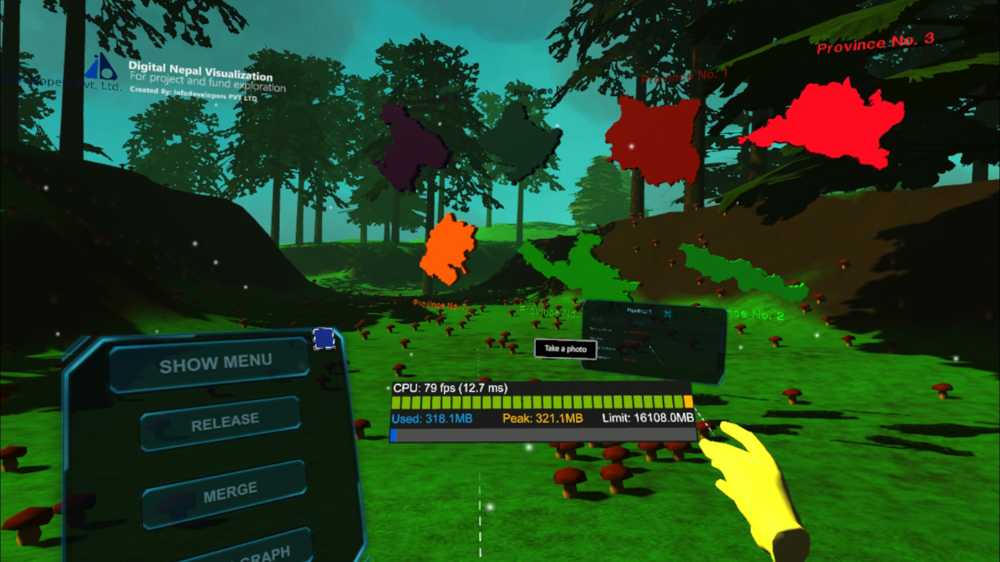
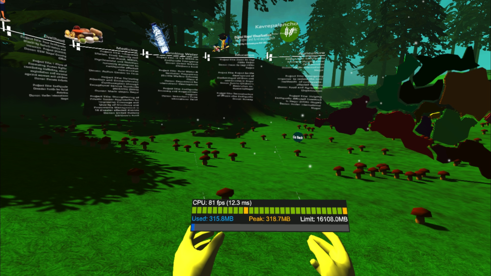
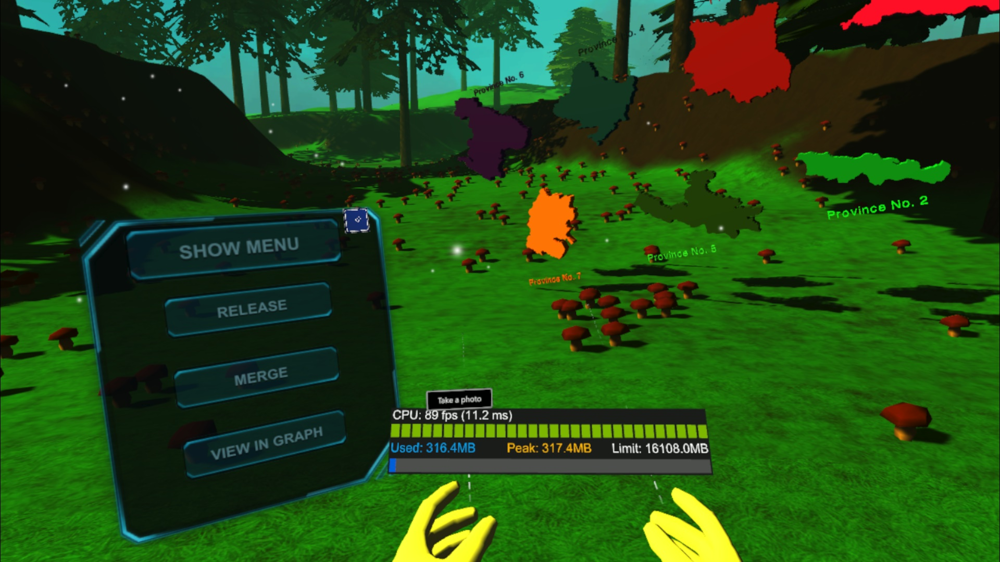
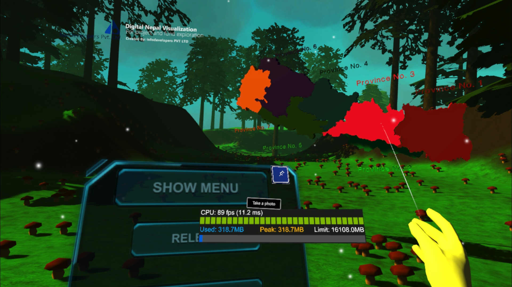

# Digital Nepal Visualization

> **A Mixed Reality demonstration for visualizing geographical and governmental project data of Nepal in an immersive environment.**

---

## Table of Contents
1. [Overview](#overview)  
2. [Features](#features)  
3. [Screenshots](#screenshots)  
4. [Project Structure](#project-structure)  
5. [Installation & Setup](#installation--setup)  
6. [Usage](#usage)  
7. [Working in Mixed Reality](#working-in-mixed-reality)  
8. [Additional Insights from the Images](#additional-insights-from-the-images)  
9. [Built With](#built-with)  
10. [License](#license)  

---

## Overview
**Digital Nepal Visualization** is a prototype application intended to demonstrate how **Mixed Reality** can be harnessed to visualize and interact with data related to Nepal's geography and development projects. Built with Unity, it places interactive 3D models of Nepal’s provinces and relevant project information within a forest-like immersive environment.

This project showcases:
- **Geographical Data:** Outlines of Nepal's provinces rendered in 3D space.  
- **Ongoing Governmental Projects:** Information on livelihood, medicine, drinking water, education, agriculture, and more.  
- **Data Visualization:** Statistics such as population counts, project details, and funding info.  
- **Mixed Reality Interactions:** Ability to view and manipulate data in a VR/AR environment or on devices like the HoloLens.  

> **Note:** When running on HoloLens, the virtual forest environment can be disabled, leaving only the data, province shapes, and UI elements floating in the user’s real-world environment.

---

## Features
- **Immersive Environment:** A whimsical forest scene with interactive mushrooms, trees, and floating UI panels.
- **3D Provinces of Nepal:** Each province is a separate colored mesh labeled with its name (Province No. 1, Province No. 2, etc.).
- **Interactive Project Data:** Hovering panels and textual information that outline details of government-funded projects.
- **Real-time Stats & UI:** A built-in stats bar (FPS, memory usage) and customizable UI with options like *Show Menu*, *Release*, *Merge*, *Scatter*, and *View in Graph*.
- **HoloLens / AR Ready:** Toggle off the background environment for a more lightweight, real-world overlay mode.

---

## Screenshots

> Please place your screenshot files in an `images` folder within the repository, and reference them below.

### 1. Overview of the VR Environment



Multiple provinces (in orange, purple, green, red, etc.) appear in 3D space. The floating menu on the left allows the user to **Show Menu**, **Release**, **Merge**, and other interactions.

### 2. Project Information Panels



Information panels list project titles, donors, and descriptions. This textual data can be rearranged, merged, or scattered for better viewing.

### 3. Province Details & CPU Usage



A real-time stats bar (FPS, memory usage) helps track performance while interacting in the environment.

### 4. Interacting with the UI



The user’s virtual hands (yellow gloves) show how one can select and click the in-world buttons to manipulate data.

---

## Project Structure
This project uses a typical Unity structure:

```
.
├── Assets
├── Library
├── Logs
├── Packages
└── ProjectSettings
```

- **Assets**: Contains all code, scenes, prefabs, scripts, and other assets (models, textures, UI).  
- **Library**: Unity’s local cache (auto-generated).  
- **Logs**: Contains project logs.  
- **Packages**: Package manifest for dependencies.  
- **ProjectSettings**: Configuration files for the Unity project.  

You can open this folder directly in **Unity 2018.4.9f1** (or a compatible version).

---

## Installation & Setup

1. **Clone the Repository**  
   ```bash
   git clone https://github.com/YourUsername/Digital-Nepal-Visualization.git
   ```

2. **Open in Unity**  
   - Make sure you have **Unity 2018.4.9f1** installed (other versions *may* work but are untested).  
   - Launch the Unity Hub, click **Open**, and select the cloned project folder.

3. **Install/Check Dependencies**  
   - Confirm required XR/AR Foundation packages (if needed) or Mixed Reality Toolkit packages in **Project Settings** or Unity **Package Manager**.

---

## Usage
1. **Open the Main Scene**  
   - After loading the project, open the primary scene (e.g., `Assets/Scenes/MainScene.unity` or similarly named).  

2. **Play in Editor**  
   - Press **Play** in Unity to experience the environment in the Editor’s Game window.  

3. **Build for Windows**  
   - Go to **File** > **Build Settings**.  
   - Choose **PC, Mac & Linux Standalone** → **Windows** platform.  
   - Click **Build** or **Build and Run** to produce an .exe file.  
   - Launch the .exe to interact with the VR environment (ensure your VR headset is supported/configured if you plan to use VR).  

> **Tip:** You can disable or enable VR in **Project Settings** → **Player** → **XR Settings** depending on your hardware.

---

## Working in Mixed Reality
- **HoloLens**:  
  - Build for the UWP platform with HoloLens XR settings enabled.  
  - Deploy and run on the HoloLens to view the provinces and data in your real-world environment.  
- **Virtual Background Toggle**:  
  - For HoloLens or AR scenarios, you can disable the forest environment so that only the provinces, text, and UI elements appear.

---

## Additional Insights from the Images
- **Immersive Forest Scene**: Tall coniferous trees and red mushrooms provide a whimsical feel for exploring data.  
- **Colored Provinces**: Each province is colored distinctly (orange, purple, green, red) to differentiate them.  
- **On-Screen Stats**: Real-time CPU and FPS stats highlight performance, which is crucial for VR/AR.  
- **Menu & Buttons**: Options like **Show Menu**, **Release**, **Merge**, **Scatter**, **View in Graph** appear on a floating UI panel.  
- **Project Panels**: Each data panel focuses on areas such as Livelihood, Medicine, Drinking Water, Education, Agriculture, with project titles, donors, and descriptions.

---

## Built With
- [Unity 2018.4.9f1](https://unity3d.com/unity/whats-new/2018.4.9) – Core game engine  
- **C#** – Primary scripting language  
- **Mixed Reality Toolkit / XR Plugins** (depending on your local setup)  
- **HoloLens** / **VR Headset** for Mixed Reality testing  

---

## License

```text
MIT License
```
